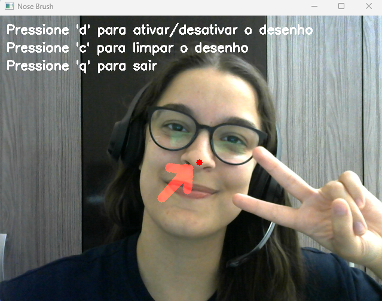

# Processamento de imagem utilizando Python 📷🐍| Pincel de Nariz (Nose Brush) 👃
<li>Rayana Caroline da Silva - PC30165867</li>
<li>Engenharia da Computação</li></li>

<h2>Guia prático de como executar a aplicação</h2>

<h3>Funcionalidades</h3>
<p><b>Desenho com o Nariz:</b> Movimente seu nariz para desenhar linhas na tela em tempo real.</p>
<p><b>Controles:</b></p> 
<li>Pressione 'd' para ativar ou desativar o modo de desenho.</li>
<li>Pressione 'c'para limpar a tela de desenho.</li>
<li>Pressione 'q' para sair da aplicação.</li>

<h3>Requisitos</h3>
<li>Instalar o Python: <href>https://www.python.org/downloads/</href></li>
<li>Instalar as bibliotecas OpenCV e Numpy:</li>
<p>OpenCV:</p>
<p><i>--pip install opencv-python--</i></p>
<p>Numpy:</p>
<p><i>--pip install numpy--</i></p>
<p>OBS: Comandos para rodas no terminal do VSCode</p>

## Arquivos
<h3>📁 NoseBrush</h3>
Este projeto usa Python e OpenCV para criar uma aplicação de "pintura com o nariz". Utilizando a webcam, o projeto detecta o rosto e o nariz do usuário, permitindo desenhar na tela conforme o movimento do nariz.

<h3>NoseBrush.py</h3>
Aplicação em Python que faz a captura da webcam e o reconhecimento do rosto do usuário. 

<h3>haarcascade_frontalface_default.xml</h3>
Este arquivo foi treinado para reconhecer rostos humanos. Ele é um dos arquivos de Haar Cascade pré-treinados fornecidos pelo OpenCV.
<h3>nose.xml</h3> 
Este arquivo detecta a posição do nariz no rosto e foi obtido do repositório [SimpleCV no GitHub](https://github.com/sightmachine/SimpleCV). Esse arquivo é fundamental para que o projeto reconheça o nariz e permita desenhar com seu movimento.

## Detalhes Técnicos

Além da detecção de rosto e nariz, o projeto implementa alguns aspectos de processamento de imagem:

- **Acesso a Vídeo**: O programa captura vídeo ao vivo pela webcam usando OpenCV.
- **Filtros de Imagem**:
  - **Escala de Cinza**: Converte o vídeo para escala de cinza, facilitando a detecção de características do rosto e nariz.
- **Processamento de Imagem**:
  - **Camada Transparente para Desenho**: O desenho é feito em uma camada separada, facilitando a combinação do desenho com o vídeo original.
- **Identificação e Rastreio**:
  - **Detecção de Nariz**: A posição do nariz é detectada em cada quadro e usada para rastrear o movimento, possibilitando o desenho com precisão.
  
Essas técnicas ajudam a tornar o desenho fluido e responsivo ao movimento do nariz, criando uma experiência interativa para o usuário.

## Instalação

**Clone este repositório**:
   ```bash
   git clone https://github.com/raysilva02/ProjetoProcessamentoImagem.git
   cd ProjetoProcessamentoImagem
```
## Teste você também 😊


